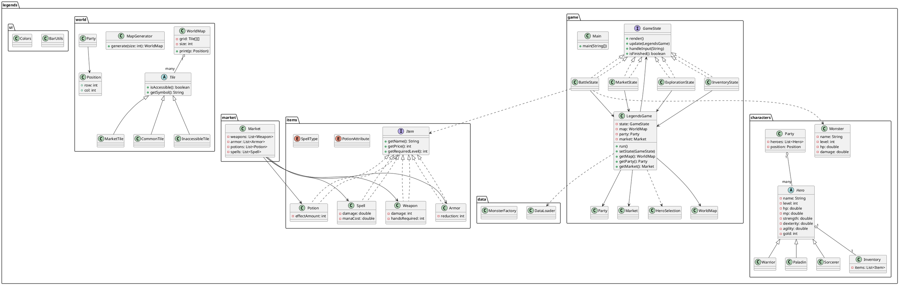

## CS 611: Object Oriented Principles and Practices
# Legends of Valor: Monsters and Heroes

A console-based, turn-based RPG built in Java using object-oriented design and classic design patterns.  
You explore a randomly generated world, assemble a party of heroes, visit markets, and battle monsters in a tactical, turn-based combat system.

---

## Student Information

- **Name:** Archit Kiran Kumar  
- **BUID:** U15354769  
- **Email:** architkk@bu.edu  

---

## File & Package Overview

Project is organized into the following top-level packages:

- `legends.game` – Core game loop and game states (intro, exploration, battle, inventory, market, etc.).
- `legends.characters` – Heroes, monsters, party and related character logic.
- `legends.items` – Items (weapons, armor, potions, spells) and their shared interface.
- `legends.market` – Market implementation for buying / selling items.
- `legends.world` – World map, tiles, positions, and map generation.
- `legends.ui` – Console UI helpers (colors, bars).
- `legends.data` – Data loading and factories for heroes, monsters, and items (from text files).

### Key Classes (by package)

#### `legends.game`

- **`Main`**  
  Entry point. Creates a `LegendsGame` instance and calls `run()`.

- **`LegendsGame`**  
  Orchestrates the whole game: holds the current `GameState`, the `WorldMap`, `Party`, and `Market`.  
  - Initializes map (`MapGenerator`), market (`Market`), and data (`DataLoader`).  
  - Runs the main game loop (`gameLoop`) which repeatedly calls `render`, reads input, `handleInput`, and `update` on the current state.  
  - Shows the intro screen and triggers hero selection before entering exploration.

- **`GameState` (interface)**  
  Defines the contract for all game states:
  - `void render()`
  - `void update(LegendsGame game)`
  - `void handleInput(String input)`
  - `boolean isFinished()`

- **`ExplorationState`**  
  Handles overworld exploration:
  - Shows the map and party position.
  - Accepts movement inputs (`W/A/S/D`), `I` for inventory, `Q` to quit.
  - Triggers markets when stepping on `M` tiles.
  - Randomly starts battles based on tile type.

- **`BattleState`**  
  Turn-based combat controller:
  - Manages heroes’ turn order and monsters’ actions.
  - Offers actions: Attack, Cast Spell, Use Potion, Change Equipment, Show Stats, Flee.
  - Applies damage, dodge chance, spell effects and end-of-round regeneration.
  - On victory: rewards XP and gold, revives fainted heroes, then returns to exploration.
  - On defeat: ends the game.

- **`InventoryState`**  
  Inventory management:
  - First screen: choose which hero’s inventory to view.
  - Second screen: per-hero inventory showing items with aligned table formatting.
  - Allows equipping weapons/armor and using potions.

- **`MarketState`**  
  Market interaction:
  - Main market menu: Buy, Sell, Back.
  - Buy menu: choose category (Weapons, Armor, Potions, Spells), then item and buyer hero.
  - Sell menu: choose hero, category, and item to sell at 50% value.
  - Uses `Market` getters and hero inventory.

- **`HeroSelection`**  
  Hero selection flow:
  - Loads Warriors, Paladins, Sorcerers via `DataLoader`.
  - Enforces PDF rules: HP = level × 100, MP = level × 50 at game start.
  - Prints grouped hero list with stats and ANSI colors.
  - Allows the player to choose between 1 and 3 heroes.
  - Returns a fully constructed `Party`.

#### `legends.characters`  *(only high-level summary here)*

- **`Hero` (abstract)**  
  Base class for all hero types (Warrior, Paladin, Sorcerer). Holds common stats (level, HP, MP, STR, DEX, AGI, gold, inventory, etc.) and combat helpers (attack damage, dodge chance, usePotion, equipWeapon/Armor, etc.).

- **`Warrior`, `Paladin`, `Sorcerer`**  
  Concrete hero types with different stat emphases (melee, balanced, magic).

- **`Monster`**  
  Represents an enemy; has HP, damage, defense, dodge chance, level, etc.

- **`Party`**  
  Contains the list of heroes and current `Position`.  
  - Movement (`moveTo`)  
  - Utility like `getAliveHeroes()`, `getRandomAliveHero()`, `allDead()`, `printStats()`.

- **`Inventory`**  
  Holds a hero’s items and provides `getItems()`, `addItem`, `removeItem`, and `printFormatted(int width)`.

#### `legends.items`

- **`Item` (interface)**  
  Common contract for all items:
  - `String getName()`
  - `int getPrice()`
  - `int getRequiredLevel()`

- **`Weapon`**  
  Adds `damage`, `handsRequired` and `getHands()`.  
  `toString()` prints level, damage and hands.

- **`Armor`**  
  Adds `reduction` (damage reduction).

- **`Potion`**  
  Adds `effectAmount` and `List<PotionAttribute>` describing which stats it affects.

- **`Spell`**  
  Adds `damage`, `manaCost`, and `SpellType` (`FIRE`, `ICE`, `LIGHTNING`).  
  BattleState applies type-specific debuffs (defense, damage, dodge).

- **`PotionAttribute` (enum)**  
  `HEALTH`, `MANA`, `STRENGTH`, `DEXTERITY`, `AGILITY`.

- **`SpellType` (enum)**  
  `FIRE`, `ICE`, `LIGHTNING`.

#### `legends.market`

- **`Market`**  
  Holds category-separated lists: `List<Weapon>`, `List<Armor>`, `List<Potion>`, `List<Spell>`.  
  - Constructor 1: takes separate lists.  
  - Constructor 2 (preferred): takes `List<Item>` and sorts into type-specific lists.

#### `legends.world`

- **`Tile` (abstract)**  
  Base tile; defines:
  - `boolean isAccessible()`
  - `String getSymbol()`

- **`CommonTile`**  
  Accessible, shown as `.` on the map.

- **`InaccessibleTile`**  
  Not accessible, shown as `X`.

- **`MarketTile`**  
  Accessible market tile, shown as `M`.

- **`Position`**  
  Simple row/col pair for the party’s location.

- **`WorldMap`**  
  2D grid of `Tile`s with helper methods:
  - `setTile`, `getTile`, `inBounds`, `canMove`.
  - `print(Position partyPos)` draws a colored grid with borders and party marker `P`.

- **`MapGenerator`**  
  Randomly generates a `WorldMap` with configurable size:
  - ~20% `InaccessibleTile`, ~15% `MarketTile`, remaining `CommonTile`.
  - Can be easily tweaked to adjust map density and difficulty.

#### `legends.ui`

- **`BarUtils`**  
  Builds colored HP/MP bars given current, max, and bar length.

- **`Colors`**  
  Centralized ANSI color constants (foregrounds, some backgrounds, bold, underline).

#### `legends.data`  *(high-level)*

- **`DataLoader`**  
  Reads text files for heroes, items, and monsters and constructs Java objects at startup.  
  Also exposes collections like `loadWarriors()`, `loadPaladins()`, etc.

- **`MonsterFactory`**  
  Utility for generating a set of monsters suitable for the current party (e.g., based on level and size).

---

## Compilation & Run Instructions (Terminal)

Assuming your project root is the directory that contains the `legends/` folder and all `.java` files.

**Compile all Java sources**

   ```
   cd path/to/project/root

   # Compile all .java files into a 'bin' directory
   javac -d bin $(find . -name "*.java") 
   ```
<br>

# I/O Example

```
══════════════════════════════════════════════
           🏰  LEGENDS OF VALOR  🗡️
══════════════════════════════════════════════

Welcome, traveler!
Your journey begins in a world filled with danger,
magic, and legendary monsters. Build a powerful team
of heroes and guide them to victory.

HOW TO PLAY THE GAME:

 • EXPLORE THE WORLD
   Move across the map using W / A / S / D.
   Markets (M) offer supplies. Inaccessible tiles (X) cannot be crossed.
   Your party is shown as the symbol 'P'.

 • BUILD YOUR PARTY
   Choose 1–3 heroes from Warriors, Paladins, and Sorcerers.
   Each class has unique strengths — mix them wisely.

 • MARKETS & ITEMS
   Visit markets to buy weapons, armor, spells, and potions.
   Open your inventory anytime with 'I'.
   Manage equipment per hero and optimize your loadout.

 • TURN-BASED BATTLES
   When monsters appear, each hero acts in order:
      - Attack with weapons
      - Cast spells
      - Use potions
      - Change equipment
   After the heroes finish, monsters take their turn.
   Use strategy — dodges, debuffs, and mana matter!

 • PROGRESSION & RECOVERY
   After each battle:
      - Heroes regenerate 10% HP & MP between rounds
      - Fallen heroes revive at 50% HP/MP if the party wins
      - All heroes gain XP & gold to grow stronger over time

TIP:
 • Press 'I' during exploration to open inventory.
 • Press 'Q' in battle to flee.
 • Safe tiles reduce chance of encounters.

Press ENTER when you're ready to begin...

Welcome to Legends of Valor!

=================================================
            🧙 HERO SELECTION 🛡️
=================================================
Choose from Warriors, Paladins, Sorcerers.

⚔️  WARRIORS — Strong melee fighters
No   Name                 Lvl  HP     MP     STR    DEX    AGI   
--------------------------------------------------------
1    Gaerdal_Ironhand     1    100    50     700    600    500   
2    Sehanine_Monnbow     1    100    50     700    500    800   
3    Muamman_Duathall     1    100    50     900    750    500   
4    Flandal_Steelskin    1    100    50     750    700    650   
5    Undefeated_Yoj       1    100    50     800    700    400   
6    Eunoia_Cyn           1    100    50     700    600    800   

🛡️  PALADINS — Holy warriors with balanced stats
No   Name                 Lvl  HP     MP     STR    DEX    AGI   
--------------------------------------------------------
7    Parzival             1    100    50     750    700    650   
8    Sehanine_Moonbow     1    100    50     750    700    700   
9    Skoraeus_Stonebones  1    100    50     650    350    600   
10   Garl_Glittergold     1    100    50     600    400    500   
11   Amaryllis_Astra      1    100    50     500    500    500   
12   Caliber_Heist        1    100    50     400    400    400   

✨ SORCERERS — Powerful magic users
No   Name                 Lvl  HP     MP     STR    DEX    AGI   
--------------------------------------------------------
13   Rillifane_Rallathil  1    100    50     750    500    450   
14   Segojan_Earthcaller  1    100    50     800    650    500   
15   Reign_Havoc          1    100    50     800    800    800   
16   Reverie_Ashels       1    100    50     800    400    700   
17   Kalabar              1    100    50     850    600    400   
18   Skye_Soar            1    100    50     700    500    400   


You may choose between 1 and 3 heroes.
Select by number, or 0 to finish.

Select hero 1 of 3 (0 = done): 1
✔ Added Gaerdal_Ironhand
Select hero 2 of 3 (0 = done): 9
✔ Added Skoraeus_Stonebones
Select hero 3 of 3 (0 = done): 15
✔ Added Reign_Havoc

You have reached the maximum (3).

=============== YOUR PARTY ===============
 → Gaerdal_Ironhand (Level 1)
    HP: 100 / 100
    MP: 50 / 50
    STR: 700   DEX: 600   AGI: 500   Gold: 1354

 → Skoraeus_Stonebones (Level 1)
    HP: 100 / 100
    MP: 50 / 50
    STR: 650   DEX: 350   AGI: 600   Gold: 2500

 → Reign_Havoc (Level 1)
    HP: 100 / 100
    MP: 50 / 50
    STR: 800   DEX: 800   AGI: 800   Gold: 2500

===========================================


=== WORLD MAP ===
┏━━━┳━━━┳━━━┳━━━┳━━━┳━━━┳━━━┳━━━┓
┃ P ┃ · ┃ M ┃ · ┃ M ┃ · ┃ · ┃ · ┃
┣━━━╋━━━╋━━━╋━━━╋━━━╋━━━╋━━━╋━━━┫
┃ · ┃ · ┃ M ┃ M ┃ · ┃ · ┃ · ┃ M ┃
┣━━━╋━━━╋━━━╋━━━╋━━━╋━━━╋━━━╋━━━┫
┃ M ┃ · ┃ M ┃ M ┃ · ┃ · ┃ · ┃ · ┃
┣━━━╋━━━╋━━━╋━━━╋━━━╋━━━╋━━━╋━━━┫
┃ X ┃ M ┃ M ┃ · ┃ · ┃ · ┃ M ┃ M ┃
┣━━━╋━━━╋━━━╋━━━╋━━━╋━━━╋━━━╋━━━┫
┃ X ┃ · ┃ · ┃ X ┃ · ┃ M ┃ · ┃ M ┃
┣━━━╋━━━╋━━━╋━━━╋━━━╋━━━╋━━━╋━━━┫
┃ · ┃ · ┃ · ┃ · ┃ M ┃ · ┃ M ┃ · ┃
┣━━━╋━━━╋━━━╋━━━╋━━━╋━━━╋━━━╋━━━┫
┃ · ┃ M ┃ · ┃ · ┃ · ┃ X ┃ · ┃ · ┃
┣━━━╋━━━╋━━━╋━━━╋━━━╋━━━╋━━━╋━━━┫
┃ X ┃ · ┃ M ┃ X ┃ · ┃ · ┃ M ┃ M ┃
┗━━━┻━━━┻━━━┻━━━┻━━━┻━━━┻━━━┻━━━┛
Controls: W/A/S/D to move, 'I' to open Inventory, 'Q' to quit

╔════════════════════════════════════════════════════════════════════════╗
║                                 MARKET                                 ║
╠════════════════════════════════════════════════════════════════════════╣
║  1. Buy Items                                                          ║
║  2. Sell Items                                                         ║
║  B. Back to Map                                                        ║
╚════════════════════════════════════════════════════════════════════════╝

╔════════════════════════════════════════════════════════════╗
║                       INVENTORY MENU                       ║
╠════════════════════════════════════════════════════════════╣
║ 1. Gaerdal_Ironhand  Lvl:1    HP:100    Gold:1354          ║
║ 2. Skoraeus_Stonebones  Lvl:1    HP:100    Gold:2500       ║
║ 3. Reign_Havoc      Lvl:1    HP:100    Gold:2500           ║
║ B. Back to Map                                             ║
╚════════════════════════════════════════════════════════════╝

A wild group of monsters appears!

Press ENTER to begin the battle
Press Q to flee back to safety

--- NEW ROUND ---

████████████████ 🛡️  BATTLE  🗡️ ████████████████

╔════════════════════════════════════════════════════╗
║                       HEROES                       ║
╠════════════════════════════════════════════════════╣
║ Gaerdal_Ironhand                                   ║
║ HP: ████████████ (100/100)                         ║
║                                                    ║
║ MP: ████████████ (50/50)                           ║
║                                                    ║
║ Skoraeus_Stonebones                                ║
║ HP: ████████████ (100/100)                         ║
║                                                    ║
║ MP: ████████████ (50/50)                           ║
║                                                    ║
║ Reign_Havoc                                        ║
║ HP: ████████████ (100/100)                         ║
║                                                    ║
║ MP: ████████████ (50/50)                           ║
║                                                    ║
╚════════════════════════════════════════════════════╝

╔════════════════════════════════════════════════════╗
║                      MONSTERS                      ║
╠════════════════════════════════════════════════════╣
║ Casper                                             ║
║ HP: ████████████ (100/100)                         ║
║                                                    ║
║ Blinky                                             ║
║ HP: ████████████ (100/100)                         ║
║                                                    ║
║ BigBad-Wolf                                        ║
║ HP: ████████████ (100/100)                         ║
║                                                    ║
╚════════════════════════════════════════════════════╝

╔════════════════════════════════════════════════════╗
║                      ACTIONS                       ║
╠════════════════════════════════════════════════════╣
║ Turn: Gaerdal_Ironhand                             ║
╠────────────────────────────────────────────────────╣
║ 1. Attack                                          ║
║ 2. Cast Spell                                      ║
║ 3. Use Potion                                      ║
║ 4. Change Equipment                                ║
║ 5. Show Party Stats                                ║
║ Q. Flee                                            ║
╚════════════════════════════════════════════════════╝

Choose action for Gaerdal_Ironhand:
```

# Design Patterns Used

- State Pattern <br>
	- GameState interface + concrete ExplorationState, BattleState, InventoryState, MarketState, HeroSelection. <br>
	- LegendsGame holds a GameState reference and delegates render, handleInput, and update. <br>
	- Makes it easy to add more states (e.g., PauseState, SettingsState) without touching existing ones.

- Factory / Factory Method<br>
	- MonsterFactory.generateMonstersForParty(...) encapsulates logic to create an appropriate set of monsters based on the party.<br>
	- MapGenerator.generate(size) centralizes world creation and randomness.<br>
	- DataLoader acts as a factory for heroes, items, and monsters from text files.

- Strategy Pattern<br>
	- Item is an interface; different item types (Weapon, Armor, Potion, Spell) implement their own behavior but can be handled polymorphically.

	- SpellType and PotionAttribute enums combined with logic in BattleState and Hero allow flexible behavior per type without large if/else chains scattered across the codebase.

- Facade Pattern<br>
	- Each package hides its implementation details; other packages only use public APIs (Party, Market, WorldMap, etc.), making future changes safer.


# Object Design Qualities

- Scalability <br>
	- Clear separation between:
	- World (WorldMap, Tile, MapGenerator)
	- Characters (Party, Hero, Monster)
	- Items (Item hierarchy)
	- 	Game Flow (GameState + LegendsGame)
	-	To add:
	-	New hero classes → add a subclass of Hero and load from data files.
	-	New tiles → extend Tile and optionally tweak MapGenerator.
	-	New items → implement Item and plug into Market/DataLoader.

- Extendibility <br>
	-	GameState interface makes adding new screens simple.
	-	Enums (SpellType, PotionAttribute) make it easy to add new behavior cases in one place.
	-	Market works off Item interface; any new item implementing Item can be bought/sold with minimal changes.
	-	WorldMap.print and BarUtils centralize UI formatting, so UI style changes don’t require touching game logic.

<br>


# Implementation Qualities

## Usability
- Clear text menus, color coding, and boxed layouts help the player easily understand the interface.
- Consistent keybindings throughout the game:
  - **W / A / S / D** → Movement
  - **I** → Inventory
  - **Q** → Quit or Flee (context-dependent)
- The Hero Selection screen clearly communicates how many heroes can be chosen and shows detailed stats for decision-making.

## Readability
- Classes are short and focused on a single responsibility  
  (e.g., `MarketState` only handles the market flow).
- Helper methods such as:
  - `chooseHeroForTransaction`
  - `buyFromList`
  - `sellFromList`
  - `printItemTable`
  - `printHeroMenu`  
  help reduce duplication and make the code self-describing.
- Javadoc-style comments were added throughout the codebase to explain higher-level components such as game states, transitions, and UI systems.

## Best Practices
- Use of interfaces (`GameState`, `Item`) and enums (`SpellType`, `PotionAttribute`) prevents hard-coded strings and improves type safety.
- **Separation of concerns**:
  - Data loading is handled by `DataLoader`
  - Gameplay flow is handled using different `GameState` classes
  - Presentation (UI printing, bars, colors, etc.) is centralized via helpers like `BarUtils` and `WorldMap.print`
- **Avoiding duplication**:
  - Shared formatting helpers for tables and menus.
  - Shared input-safety functions using `try/catch`.
- **Robust input handling**:
  - All numeric inputs are validated
  - Invalid inputs do not crash the game
  - The game falls back gracefully with error messages
- **Reset-to-default behavior**:
  - All stats are reloaded from the data files at the start of each run (per assignment requirement), ensuring clean game state.

---

# Key Highlights & Features

- **Randomly Generated World Map**  
  Inaccessible tiles, market tiles, and common tiles each appear with configurable probabilities.

- **Party-Based Gameplay**  
  Choose **1–3 heroes** from:
  - Warriors  
  - Paladins  
  - Sorcerers  

- **Turn-Based Battle System**
  - Heroes take turns sequentially
  - Monsters attack afterward as a group
  - Wide range of actions: attacks, spells, potions, equipment changes
  - Dodge mechanics and spell-type debuffs  
    (Fire lowers DEF, Ice lowers DMG, Lightning lowers Dodge)

- **Market & Inventory System**
  - Buy/sell weapons, armor, spells, and potions
  - Level requirements enforced
  - Per-hero gold and inventory
  - Equip and consume items directly from the inventory screen

- **Regeneration & Revival Mechanics**
  - Heroes regenerate **10% HP & MP** between battle rounds
  - Fallen heroes revive at **50% HP/MP** after a win
  - XP and gold rewards scale with number and level of monsters

- **File-Driven Game Data**
  - Heroes, monsters, weapons, armor, spells, potions loaded from external `.txt` files
  - Makes balancing and modifying game content extremely easy without code changes

- **Styled Console UI**
  - Color-coded text
  - Unicode box drawings
  - Smooth HP/MP bar rendering
  - Clear section headers for readability

<br>

---

## DESIGN.md – UML Overview

Here’s a UML-style overview you can put into a separate `DESIGN.md`. I’ll also include a PlantUML snippet you can feed to any UML tool.

```markdown
# Legends of Valor – Design & UML Overview

## 1. High-Level Architecture

The project follows a layered, package-based structure:

- **Game Flow Layer** (`legends.game`)
- **Domain Layer**  
  - Characters (`legends.characters`)  
  - Items (`legends.items`)  
  - World (`legends.world`)  
  - Market (`legends.market`)
- **Infrastructure Layer** (`legends.data`, `legends.ui`)

The **State pattern** is used to handle different game modes (exploration, battle, inventory, market, hero selection) while `LegendsGame` acts as the central controller.

---

## 2. Core Class Diagram (Textual Overview)

### Game Flow

- `LegendsGame`
  - -state: GameState  
  - -map: WorldMap  
  - -party: Party  
  - -market: Market  
  - +run()  
  - +setState(GameState)  
  - +getMap(), getParty(), getMarket()

- `Main`
  - +main(String[]): creates `LegendsGame`, calls `run()`.

- `GameState` (interface)
  - +render()  
  - +update(LegendsGame)  
  - +handleInput(String)  
  - +isFinished(): boolean

- `ExplorationState` implements `GameState`
  - -map: WorldMap  
  - -party: Party  
  - -game: LegendsGame

- `BattleState` implements `GameState`
  - -game: LegendsGame  
  - -party: Party  
  - -monsters: List<Monster>  
  - -turnOrder: List<Hero>  
  - -turnIndex: int

- `InventoryState` implements `GameState`
  - -game: LegendsGame  
  - -selectedHero: Hero

- `MarketState` implements `GameState`
  - -game: LegendsGame  
  - -market: Market

- `HeroSelection`
  - -warriors: List<Warrior>  
  - -paladins: List<Paladin>  
  - -sorcerers: List<Sorcerer>  
  - +selectHeroes(): Party

### Characters

- `Hero` (abstract)
  - -name, level, hp, mp, strength, dexterity, agility, gold  
  - -inventory: Inventory  
  - +getAttackDamage(), getDodgeChance(), addExperience(), earnGold(), etc.

- `Warrior`, `Paladin`, `Sorcerer` extend `Hero`

- `Monster`
  - -name, level, hp, damage, defense, dodgeChance  
  - +takeDamage(), etc.

- `Party`
  - -heroes: List<Hero>  
  - -position: Position  
  - +getHeroes(), getAliveHeroes(), getRandomAliveHero(), allDead(), moveTo(Position), printStats()

- `Inventory`
  - -items: List<Item>  
  - +getItems(), addItem(Item), removeItem(Item), printFormatted(int)

### Items / Market

- `Item` (interface)
  - +getName(), getPrice(), getRequiredLevel()

- `Weapon` implements `Item`
  - -damage: int  
  - -handsRequired: int

- `Armor` implements `Item`
  - -reduction: int

- `Potion` implements `Item`
  - -effectAmount: int  
  - -attributes: List<PotionAttribute>

- `Spell` implements `Item`
  - -damage: double  
  - -manaCost: double  
  - -type: SpellType

- `PotionAttribute` enum  
- `SpellType` enum  

- `Market`
  - -weapons: List<Weapon>  
  - -armor: List<Armor>  
  - -potions: List<Potion>  
  - -spells: List<Spell>

### World

- `WorldMap`
  - -grid: Tile[][]  
  - -size: int  
  - +setTile(), getTile(), inBounds(), canMove(), print(Position)

- `Tile` (abstract)
  - +isAccessible(): boolean  
  - +getSymbol(): String

- `CommonTile`, `InaccessibleTile`, `MarketTile` extend `Tile`

- `Position`
  - +row: int  
  - +col: int

- `MapGenerator`
  - +generate(int size): WorldMap

### Data & UI

- `DataLoader`
  - +loadWarriors(), loadPaladins(), loadSorcerers()  
  - +loadAllItems(), loadAllMonsters()  
  - static `globalMonsters`

- `MonsterFactory`
  - +generateMonstersForParty(Party): List<Monster>

- `BarUtils`
  - +makeBar(current, max, length): String

- `Colors`
  - ANSI color constants.

---

## 3. PlantUML Snippet (for Diagram Generation)

You can paste this into a PlantUML renderer to generate a visual UML class diagram (it’s partial but covers core structure):

